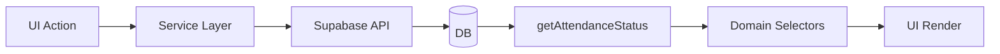

# 🧭 ATTENDANCE SYSTEM — REFACTOR BLUEPRINT (FINAL)

## 🎯 목표 구조

> UI / 로직 / 데이터 / 상태 계산을 완전히 분리한 “State Machine 기반 아키텍처”

---

# 🧱 1. 최종 폴더 구조

```txt id="root1"
src/
│
├── app/                          # 앱 엔트리 / 라우팅
│   ├── App.jsx
│   ├── router.jsx
│
├── components/                   # UI (pure presentational)
│   ├── TodayTab.jsx
│   ├── AdminTab.jsx
│   ├── AttendanceCard.jsx
│   ├── AttendanceList.jsx
│
├── domain/attendance/            # ⭐ 핵심 상태 머신 레이어
│   ├── getAttendanceStatus.js   # SINGLE SOURCE OF TRUTH
│   ├── selectors.js             # 상태 기반 필터
│   ├── constants.js             # OPEN/PENDING/APPROVED/CLOSED
│
├── services/                     # DB interaction layer
│   ├── checkInService.js
│   ├── checkOutService.js
│   ├── attendanceApproval.js
│
├── hooks/                        # state/data hooks
│   ├── useAttendance.js
│
├── api/                          # Supabase wrapper
│   ├── attendanceApi.js
│
├── utils/                        # pure helpers
│   ├── buildCheckInRow.js
│   ├── timeUtils.js
│
├── store/                        # (optional) global state
│   ├── attendanceStore.js
│
├── styles/
│
└── types/                        # (optional TS)
    ├── attendance.types.js
```

---

# 🧠 2. 레이어 책임 정의

## 🟢 UI Layer (`components/`)

👉 역할:

* 렌더링만 담당
* 상태 판단 ❌
* DB 로직 ❌

```txt id="ui1"
ONLY:
props + selectors 결과만 사용
```

---

## 🟡 Domain Layer (`domain/attendance/`) ⭐ 핵심

👉 역할:

* 상태 머신 정의
* 모든 상태 계산 책임

```txt id="dom1"
getAttendanceStatus(row)
selectors (OPEN/PENDING/...)
constants
```

👉 절대 DB 접근 금지

---

## 🔵 Service Layer (`services/`)

👉 역할:

* DB write only
* 비즈니스 로직 없음

```txt id="svc1"
checkInService → insert
attendanceApproval → update approved
```

---

## 🟣 API Layer (`api/`)

👉 역할:

* Supabase 직접 호출 캡슐화

```txt id="api1"
from("attendance")
select/insert/update
```

---

## 🟤 Utils (`utils/`)

👉 역할:

* 순수 함수
* 상태 없음

```txt id="util1"
buildCheckInRow
time calculation
formatters
```

---

# 🔄 3. 데이터 흐름 (FINAL FLOW)



---

# 🧠 4. 핵심 원칙 (ABSOLUTE RULES)

## ❌ 금지

* UI에서 check_in/out 직접 판단
* approved 직접 로직 분기
* DB에서 status 컬럼 추가
* evaluateCheckIn에서 자동 승인

---

## ✅ 허용

* getAttendanceStatus(row)
* selectors.js
* service layer only DB writes

---

# 🧮 5. Domain Layer 핵심 구조

## 📄 `getAttendanceStatus.js`

```js id="d1"
OPEN | PENDING | APPROVED | CLOSED
```

👉 이 파일이 시스템의 “두뇌”

---

## 📄 `selectors.js`

```js id="d2"
selectByStatus(list, "PENDING")
```

---

# 🏗 6. Service Layer 구조

## check-in

```txt id="s1"
buildCheckInRow → checkInService → DB insert
```

---

## approval

```txt id="s2"
attendanceApproval → approved=true
```

---

# 📊 7. 시스템 구조 철학

## 🧠 Clean Architecture + State Machine Hybrid

```txt id="arch1"
UI → Domain → Service → API → DB
                 ↑
          State Machine (only here)
```

---

# 💣 8. 기존 구조에서 제거할 것

## ❌ 반드시 제거

* check_in 기반 필터
* check_out 기반 상태 판단
* approval_status 가정 로직
* evaluateCheckIn 자동 승인
* UI 내부 상태 계산

---

# 🚀 9. 기대 효과

## BEFORE

* 승인 눌러도 변화 없음
* 상태 혼재
* UI 버그 반복
* 데이터 신뢰도 낮음

---

## AFTER

* 단일 상태 머신
* UI 완전 안정
* 승인 흐름 정상화
* 디버깅 구조 단순화

---

# 📌 10. 한 줄 정의

> Attendance 시스템은 DB가 아닌 Domain Layer(getAttendanceStatus)가 상태를 결정하는 구조이며, UI는 이를 소비만 한다.

---

# 🚀 다음 단계 (원하면)

여기서 끝이 아니라 다음 단계로:

### 👉 가능 옵션

1. 🔥 실제 migration step-by-step checklist
2. 🔥 Git branch 단위 리팩토링 plan
3. 🔥 Claude용 PR 단위 작업 분해
4. 🔥 테스트 시나리오 (버그 재발 방지)

원하면 이어서 “실전 배포용 리팩토링 플랜”까지 만들어줄게.
